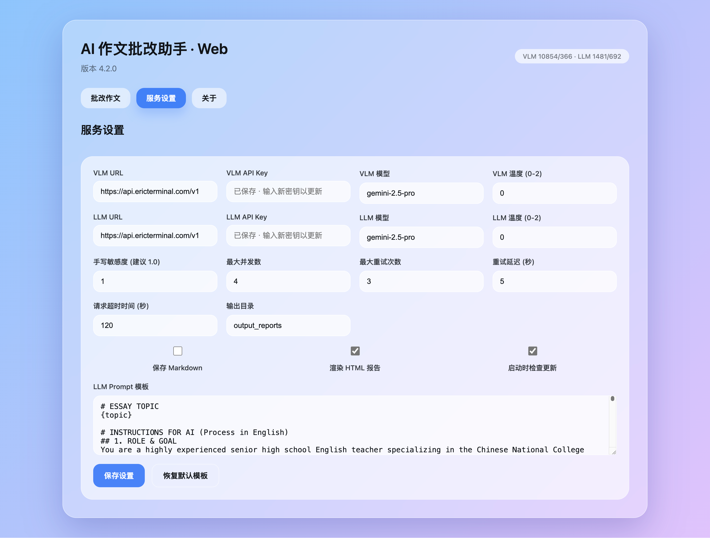
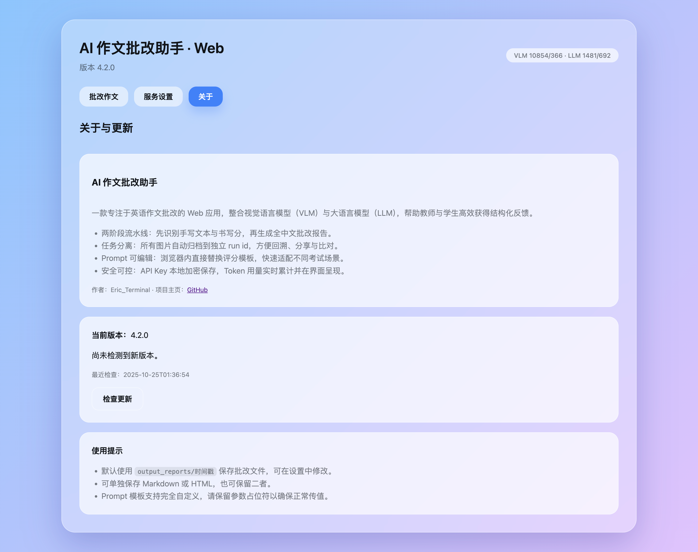
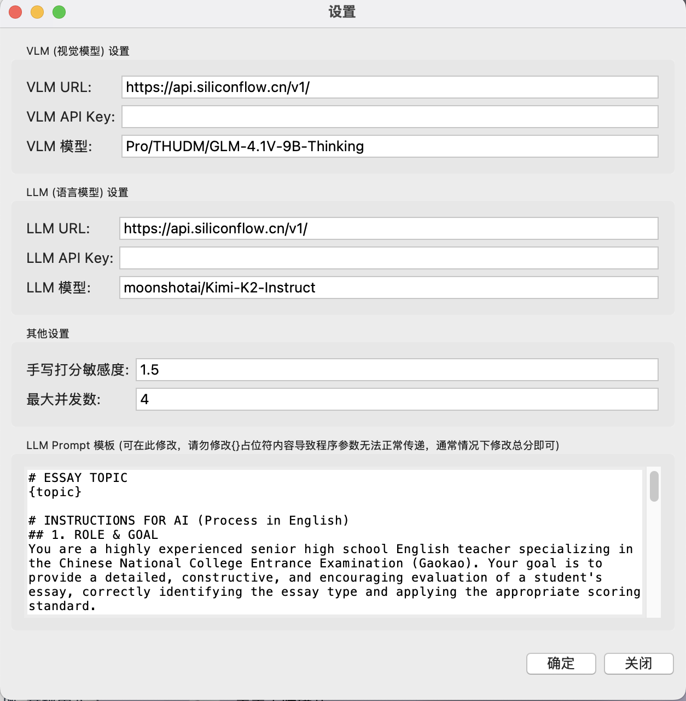

# AI 作文批改小助手 (´｡• ᵕ •｡`) ♡

(＾▽＾)ﾉﾞ 哈罗！欢迎来到AI作文批改小助手的世界！

这是一款用爱发电的桌面小工具，它能像一位经验丰富的英语老师一样，帮你自动批改手写的英文作文图片，并生成超级详细的批改报告哟～

### ☆ 应用界面预览 ☆




---

## ☆ 亮点闪闪 (Features) ☆

*   **双AI引擎驱动 (Dual AI Engine)**
    *   首先，由专业的 **视觉模型(VLM)** 来进行高精度的手写文字识别(OCR)，并像老师看卷面一样，给出一个专业的“书写质量分”！(๑•̀ㅂ•́)و✧
    *   然后，强大的 **大语言模型(LLM)** 会接棒，结合识别出的文本、作文题目和书写分，给你一份内容详实、有深度、有温度的批改报告！

*   **超级自由的可配置性 (Super Flexible)**
    *   **API随便换**：VLM和LLM的服务地址、API Key、模型名称都可以分开设置，不管你用哪家的AI服务（只要兼容OpenAI格式），都能轻松适配！
    *   **逻辑你来定**：觉得书写分太严或者太松？在设置里调一下“敏感度因子”就好啦～
    *   **模板全开放**：核心的批改指令(Prompt)模板完全开放给你！你可以在设置里直接修改它，调整评分标准、总分、或者让AI老师的语气更温柔（或者更严格！），打造你专属的批改风格！ദ്ദി(•ω•´)

*   **闪电般的并发处理 (Lightning-Fast Concurrency)**
    *   内置了超高效的多线程引擎！不管你一次选一张还是一百张图片，小助手都会派出多位AI老师**同时开始批改**，再也不用漫长地等待啦，大幅节省你的宝贵时间！O(∩_∩)O

*   **企业级的安全感 (Enterprise-Grade Security)**
    *   你的API Key是非常重要的秘密！我们使用强大的 `cryptography` 库对所有密钥都进行了**加密处理**，才会保存在本地的配置文件里。绝对不会明文泄露，让你的账户安全感满满！(｡･ω･｡)ﾉ♡

*   **开箱即用的小可爱 (Ready to Use)**
    *   项目已经为 `PyInstaller` 打包做好了万全准备，可以轻松编译成一个独立的 `.exe` 或 `.app` 文件，方便地分享给不太懂技术的朋友们使用～ (^ω^)

---

## 使用教程 (ゝ∀･)

1.  **下载程序**: 前往本仓库的 [Releases 页面](https://github.com/Eric-Terminal/Pro_llm_correct/releases) 下载适用于你操作系统的最新版本。
2.  **首次配置**:
    *   运行程序，它会发现你还没填API Key，然后自动弹出“设置”窗口。
    *   在这里填上你的 VLM 和 LLM 服务提供商的 **URL**、**API Key** 和 **模型名称**。
    *   点击“确定”保存，你的小秘密就被安全地加密保存好啦！
3.  **开始批改**:
    *   在主界面的大框框里，输入本次作文的“**题目**”。
    *   点击“**选择图片**”，可以一次选中所有学生的作文图片哟。
    *   点击“**开始批改**”，然后就可以泡杯茶，看日志区和进度条实时更新啦！
4.  **获取报告**: 任务完成后，每一张图片对应的 `.md` 格式批改报告，都会自动出现在原图片所在的文件夹里，是不是很方便呀？

---

## 给开发者小伙伴 (づ｡◕‿‿◕｡)づ

想从源码运行或者一起把它变得更好吗？欢迎欢迎！

```bash
# 1. 把这个可爱的仓库克隆到本地
git clone https://github.com/Eric-Terminal/Pro_llm_correct.git
cd Pro_llm_correct

# 2. (推荐) 创建一个专属的虚拟环境
python3 -m venv venv
source venv/bin/activate  # Windows上是 `venv\Scripts\activate` 哦

# 3. 安装所有需要的魔法咒语 (依赖)
pip install -r requirements.txt

# 4. 运行！
python main.py
```

### 打包成魔法小盒子 (o´ω`o)ﾉ

想把它打包成一个独立的程序吗？用 `PyInstaller` 就行啦！

```bash
# --noconsole: 这样运行时就不会弹出黑乎乎的命令行窗口啦
# --onefile: 把所有东西都打包成一个文件，干净！
pyinstaller --noconsole --onefile main.py
```
打包好的魔法小盒子会出现在 `dist` 文件夹里。

---

## 开源许可证 (License) ( ´ ▽ ` )ﾉ

本项目采用 [MIT License](LICENSE) 开源。简单来说，就是你可以自由地使用、修改和分享它，只要保留原始的版权声明就好啦～

---

*由 Eric-Terminal 精心创造。如果你喜欢这个项目，请不要吝啬你的 Star ☆ 哦！(⁄ ⁄•⁄ω⁄•⁄ ⁄)*
