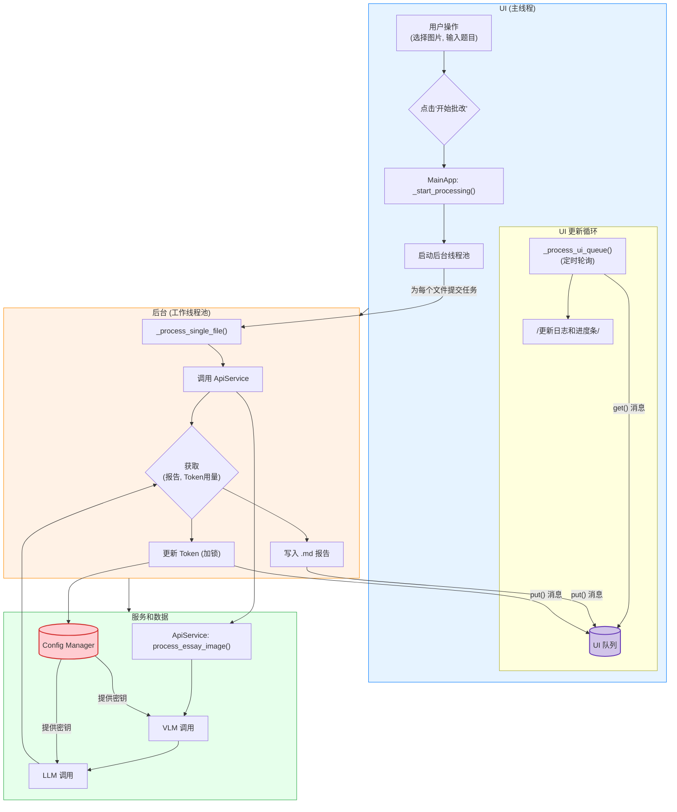

# AI 作文批改助手 - 深度代码分析与架构报告

## 1. 项目概述与设计哲学

本项目是一个基于 Python 和 Tkinter 的桌面应用程序，名为 “AI 作文批改助手”。其核心目标是利用先进的 AI 模型，为教育者和学生提供一个高效、精准且高度可定制的英文作文批改解决方案。

**设计哲学**:
该应用的核心设计哲学是 **“专业分工”** 与 **“极致灵活”**。
-   **专业分工**: 它不依赖单一的通用 AI 模型，而是采用“视觉语言模型(VLM)” + “大语言模型(LLM)”的两步式处理流程。VLM 专注于其擅长的图像识别和质量评估，而 LLM 则负责深度、富有逻辑的文本分析与批改。这种分工确保了流程的每个环节都由最合适的工具来完成，从而最大化了准确性和效率。
-   **极致灵活**: 开发者深刻理解不同用户（或不同教学场景）对批改的要求千差万别。因此，应用将所有核心参数，从 API 服务地址、模型名称，到最关键的 LLM 指令模板（Prompt），都开放给用户配置。这使得应用不仅仅是一个工具，更是一个可以被用户“训练”和“塑造”的个性化批改平台。

---

## 2. 核心功能与工作流程（深度解析）

应用程序的工作流程经过精心设计，确保了健壮性、效率和优秀的用户体验。

1.  **启动与配置校验**:
    -   应用启动时，`ConfigManager` 会立刻加载 `config.json`。如果文件不存在，它会自动创建一个空的，避免了首次运行因缺少文件而崩溃。
    -   在主界面初始化时，会调用 `config_manager.check_settings()` 检查所有必需的 API 配置。如果任何一项缺失，程序会进入一个**强制配置循环** (`_show_config_dialog_until_valid`)，不断弹出设置窗口，直到用户填妥所有关键信息为止，确保了后续 API 调用的先决条件。

2.  **用户交互**:
    -   用户在主界面的 `tk.Text` 组件中输入作文题目。这里有一个非常贴心的 UI 细节：通过绑定 `<FocusIn>` 和 `<FocusOut>` 事件，实现了输入框的占位符（Placeholder）效果，引导用户输入。
    -   用户点击“选择图片”，可以一次性选择多个文件，程序将文件路径存储在 `self.file_paths` 列表中。

3.  **并发处理启动**:
    -   点击“开始批改”后，程序首先验证文件和题目是否都已提供。
    -   然后，它会创建一个新的后台守护线程 (`threading.Thread`)，目标是 `_concurrent_worker_manager` 方法。这样做是为了将耗时的任务完全与主 UI 线程分离，防止界面冻结。
    -   `_concurrent_worker_manager` 内部使用 `concurrent.futures.ThreadPoolExecutor` 创建一个线程池，其最大工作线程数 (`max_workers`) 由用户在设置中定义。它会遍历所有图片路径，为每一张图片向线程池提交一个 `_process_single_file` 的处理任务。

4.  **两步式 AI 引擎 (核心细节)**:
    -   **步骤一：VLM 视觉分析 (`api_services.py`)**
        -   工作线程首先调用 `api_service.process_essay_image`。
        -   该方法的第一步是调用 VLM。其 Prompt 极为关键，它严格指示 VLM 扮演一个“高精度 OCR 和手写分析引擎”，并用 `<wscore>` 和 `<text>` XML 标签包裹其输出。这种结构化输出的要求，使得后续用正则表达式 (`re.search`) 解析结果变得非常可靠。
        -   应用还引入了“手写打分敏感度” (`SensitivityFactor`) 的概念。它通过 `wscore = original_wscore ** sensitivity_factor` 这行代码，对 VLM 的原始评分进行指数调整。当因子 > 1.0 时，会拉大高分和低分区间的差距，使得评分更严格；反之则更宽松。
    -   **步骤二：LLM 深度批改 (`api_services.py`)**
        -   拿到 VLM 的输出后，程序会加载 LLM 的 Prompt 模板。如果用户在设置中自定义了模板，则使用用户的版本；否则，使用 `DEFAULT_LLM_PROMPT_TEMPLATE`。
        -   这个默认模板是一个极其详尽的“元程序”，它为 LLM 设定了清晰的角色（高三英语老师）、目标、输入数据格式，并提供了详细的评分逻辑。它甚至教会了 LLM 如何根据作文字数和题目类型线索来区分“应用文”和“读后续写”这两种题型，并应用不同的总分（15分 vs 25分）。
        -   最后，程序将作文题目、调整后的书写分数和识别出的文本填入模板，向 LLM 发起最终的批改请求。

5.  **结果生成与线程安全UI更新**:
    -   `_process_single_file` 线程在收到 AI 的最终报告后，会将其写入一个新的 `.md` 文件。
    -   **关键的 UI 更新机制**:
        -   工作线程**从不直接操作**任何 Tkinter UI 组件。
        -   取而代之，它将所有需要反馈给用户的信息（如“开始处理...”、“处理完成...”、“Token用量...”、“失败...”，以及进度更新信号）都通过 `self.ui_queue.put()` 方法放入一个线程安全的 `queue.Queue` 实例中。
        -   与此同时，在主 UI 线程中，一个由 `self.root.after(100, self._process_ui_queue)` 启动的**定时轮询器**每 100 毫秒被唤醒一次。
        -   这个轮询器会尝试从队列中 `get_nowait()` 消息。一旦取到消息，它就可以**安全地**在主线程中更新日志列表框和进度条等 UI 元素。
    -   **线程安全的数据更新**: 当需要更新累计的 Token 使用量时，工作线程会使用 `with self.lock:` 来获取一个线程锁 (`threading.Lock`)，确保在任何时刻只有一个线程能修改和保存 `config.json`，避免了数据竞争和文件损坏。

---

## 3. 技术架构与设计亮点（深度分析）

-   **依赖注入 (Dependency Injection)**: 在 `main.py` 中，`ConfigManager` 和 `ApiService` 的实例被创建后，作为参数“注入”到 `MainApp` 的构造函数中。这是一种优秀的设计模式，它降低了 `MainApp` 与具体服务实现之间的耦合。如果未来需要替换 `ApiService` 的实现（例如，换成一个本地模型的服务），只需在 `main.py` 中修改一行代码，而无需改动 `MainApp` 内部。

-   **企业级的配置安全 (`config_manager.py`)**:
    -   应用没有简单地将 API 密钥明文存储，而是实现了一套强大的对称加密机制。
    -   它使用 `hashlib.pbkdf2_hmac`，这是一个基于密码的密钥派生函数。它将一个固定的内部密码 (`_ENCRYPTION_PASSWORD`) 和一个“盐” (`_SALT`) 通过大量哈希迭代（100,000次），生成一个几乎不可能被逆向破解的、安全的加密密钥。
    -   然后，它使用这个密钥初始化 `cryptography.fernet.Fernet` 实例。Fernet 保证了加密信息是经过认证的（无法被篡改），并且包含了时间戳以防止重放攻击，提供了远超普通 Base64 编码的安全性。

-   **健壮的并发模型与线程安全 (`app_ui.py`)**:
    -   这是本项目技术上最出色的部分。它完美地解决了桌面 GUI 应用中最常见的难题：如何在执行长耗时任务的同时保持界面响应。
    -   它综合运用了 `ThreadPoolExecutor` (管理工作线程)、`queue.Queue` (作为线程间通信的缓冲管道) 和 `root.after` (在主线程中创建非阻塞的轮询器)，构成了一个经典且高效的生产者-消费者模型。工作线程是消息的“生产者”，主线程的轮询器是“消费者”。
    -   同时，通过 `threading.Lock` 确保了对共享资源（配置文件）的互斥访问。这套组合拳充分展示了开发者对并发编程的深刻理解。

---

## 4. 代码中的亮点与最佳实践

-   **优雅的占位符实现**: 在 `app_ui.py` 中，通过绑定 `FocusIn` 和 `FocusOut` 事件来动态改变 `Text` 控件的内容和前景颜色，是一种轻量级且有效的实现输入框占位符的方法。
-   **对打包部署的考量**: `main.py` 中的 `resource_path` 函数是一个重要的细节。它通过检查 `sys._MEIPASS` 属性是否存在，来判断程序是在开发环境中运行还是被 PyInstaller 打包后运行，从而动态地计算配置文件的正确路径。这确保了应用在被打包成单文件可执行程序后依然能正常工作。
-   **智能的 Prompt 模板管理**: 在 `SettingsDialog` 的 `on_ok` 方法中，如果用户修改后的 Prompt 与默认模板一致，程序会将其设置为 `None`，并在保存时从配置文件中移除该键。这避免了将冗长的默认模板存入配置文件，保持了 `config.json` 的整洁。

---

## 5.  Mermaid 流程图

