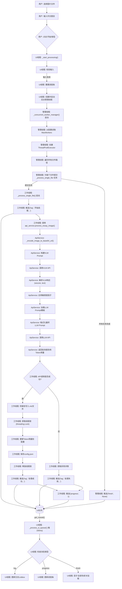

# AI 作文批改助手 - 开发者技术架构文档

## 1. 系统概述

**AI 作文批改助手** 是一款基于 Python/Tkinter 的桌面应用，旨在为教育场景提供一个高度可定制的自动化英文作文批改解决方案。其架构核心是围绕 **服务解耦**、**安全配置** 和 **健壮的并发处理** 构建的，确保了系统的灵活性、安全性与高性能。

本文档旨在为参与本项目的开发者提供清晰的架构解析、模块说明和核心工作流程，以促进高效的协同开发。

---

## 2. 模块化架构解析

系统采用分层架构，将UI、业务逻辑和配置管理严格分离。核心模块如下：

| 文件名 | 模块职责 | 关键技术/模式 |
| :--- | :--- | :--- |
| `main.py` | **应用入口 (Entry Point)** | 依赖注入 (DI) |
| `app_ui.py` | **UI与主控层 (View/Controller)** | Tkinter, 生产者-消费者模型, 并发控制 |
| `api_services.py` | **外部服务适配层 (Service Adapter)** | OpenAI API, 模板方法模式 |
| `config_manager.py` | **配置与安全层 (Configuration/Security)** | Fernet 对称加密, 单例模式思想 |

### 2.1. `main.py`: 依赖注入与启动器

-   **职责**: 作为应用的启动器，负责初始化所有核心服务 (`ConfigManager`, `ApiService`)，并将这些服务的实例 **注入** 到主应用 `MainApp` 中。
-   **设计优势**: 这种依赖注入的方式，极大地降低了 `MainApp` 与具体服务实现之间的耦合度。例如，若未来需要将 `ApiService` 切换为调用本地模型，只需在 `main.py` 中替换 `ApiService` 的实现类，而 `MainApp` 的代码无需任何改动。
-   **打包考量**: `resource_path` 函数通过检查 `sys._MEIPASS` 属性，实现了对 PyInstaller 打包环境的兼容，确保了配置文件路径在开发和部署环境中的一致性。

### 2.2. `config_manager.py`: 企业级安全配置

-   **职责**: 负责 `config.json` 的全生命周期管理，包括加载、保存、读取和写入。其核心特性是 **对敏感信息的自动加解密**。
-   **加密机制**:
    1.  **密钥派生**: 使用 `hashlib.pbkdf2_hmac` 基于固定的内部密码和盐，通过 100,000 次迭代生成一个高强度的加密密钥。这可以有效抵御彩虹表和暴力破解攻击。
    2.  **认证加密**: 利用 `cryptography.fernet.Fernet` 实现 **认证加密 (AEAD)**。这意味着加密后的数据不仅保密，还能防止篡改（完整性保护），并内置
时间戳以防止重放攻击。
-   **解密容错**: `_decrypt` 方法中包含 `try...except InvalidToken` 块，确保了即使配置文件中的某个值是未加密的旧数据或已损坏，程序也不会崩溃，而是安全地返回空字符串。

### 2.3. `api_services.py`: AI 服务适配器

-   **职责**: 封装了与外部 AI 服务（VLM 和 LLM）的所有交互细节，为上层应用提供统一、简洁的调用接口 (`process_essay_image`)。
-   **两步式 AI 流程 (Two-Step AI Pipeline)**:
    1.  **VLM 阶段**:
        -   **输入**: 图片路径。
        -   **处理**: 将图片编码为 Base64，调用 VLM API。Prompt 设计得极为严格，要求 VLM 返回 **结构化数据**（`<wscore>` 和 `<text>` XML 标签），这使得后续解析非常可靠。
        -   **输出**: 书写分数 (`wscore`) 和识别出的文本 (`essay_text`)。
    2.  **LLM 阶段**:
        -   **输入**: 作文题目、VLM 阶段的书写分数和文本。
        -   **处理**: 加载 Prompt 模板（优先使用用户自定义版本），将输入数据填入模板，调用 LLM API。
        -   **输出**: 最终的 Markdown 格式批改报告。
-   **设计优势**: 将所有 API Key、URL 和模型名称的管理完全委托给 `ConfigManager`，自身不存储任何敏感信息。同时，通过 `DEFAULT_LLM_PROMPT_TEMPLATE` 提供了开箱即用的默认行为，也支持用户通过
`config.json` 进行深度定制。

### 
2.4. `app_ui.py`: 并发模型与线程安全UI

-   **职责**: 作为应用的核心控制器，负责UI渲染、事件响应，以及 **协调UI主线程与后台工作线程的交互**。
-   **并发模型 (生产者-消费者)**: 这是本应用技术实现上最关键的部分。
    1.  **生产者 (Producer)**: 后台工作线程 (`_process_single_file`)。当用户点击“开始批改”后，`_concurrent_worker_manager` 会创建一个 `ThreadPoolExecutor` 线程池。池中的每个线程在完成一项任务（调用API、保存文件）后，会将结果或状态更新（如日志消息、进度信号）封装成一个元组 `(task_type, data)`，通过 `self.ui_queue.put()` 方法放入一个线程安全的 `queue.Queue` 实例中。
    2.  **消费者 (Consumer)**: UI主线程中的 `_process_ui_queue` 方法。该方法由 `self.root.after(100, ...)` 启动，作为一个 **非阻塞的定时轮询器**，每100毫秒被唤醒一次。它会尝试从 `ui_queue` 中 `get_nowait()` 消息。一旦获取到消息，它就可以 **安全地在UI主线程中** 执行
UI更新操作（如更新日志列表、增加进度条）。
-   **线程安全**:
    -   **UI操作**: 遵循了GUI编程的黄金法则—— **任何UI组件的修改都必须在主线程中进行**。通过 `queue.Queue` 实现了线程间通信，避免了后台线程直接操作UI组件。
    -   **数据共享**: 对于需要被多个线程修改的共享资源（累计的Token使用量），代码在 `_process_single_file` 中使用了 `with self.lock:` (`threading.Lock`) 来确保对 `config.json` 的读写操作是 **原子性** 的，从而防止了数据竞争和文件损坏。

---

## 3. 核心工作流程 (端到端)

以下是用户从点击“开始批改”到任务完成的完整数据流和控制流：

1.  **UI线程**: `_start_processing` 被触发。
    -   **校验**: 检查文件列表和作文题目是否为空。
    -   **初始化**: 重置进度条和计数器。
    -   **启动后台任务**: 创建一个新的守护线程 (`threading.Thread`)，其目标是 `_concurrent_worker_manager` 方法。这确保了耗时的任务管理器本身不会阻塞UI。

2.  **后台管理线程**: `_concurrent_worker_manager` 开始执行。
    -   **读取配置**: 从 `ConfigManager` 获取 `MaxWorkers` 参数。
    -   **创建线程池**: 实例化一个 `concurrent.futures.ThreadPoolExecutor`。
    -   **任务分发**: 遍历所有文件路径，为每个文件向线程池提交一个 `_process_single_file` 任务。

3.  **后台工作线程 (并发执行)**: `_process_single_file` 开始执行。
    -   **状态通知 (生产消息)**: 向 `ui_queue` 推入一条 `("log", "开始处理...")` 消息。
    -   **调用服务层**: 调用 `api_service.process_essay_image`，传入文件路径和题目。
        -   `ApiService` 内部依次完成VLM和LLM的API调用。
    -   **处理结果**:
        -   **成功**: 将返回的 `final_report` 写入 `.md` 文件。
        -   **成功**: 使用 `threading.Lock` 安全地更新 `ConfigManager` 中的Token用量并保存。
        -   **成功/失败**: 向 `ui_queue` 推入日志消息、Token用量消息。
    -   **进度通知 (生产消息)**: 无论成功与否，都向 `ui_queue` 推入一条 `("progress", 1)` 消息。

4.  **UI线程 (轮询)**: `_process_ui_queue` 定期执行。
    -   **消费消息**: 从 `ui_queue` 中取出消息。
    -   **解析与执行**: 根据消息类型 (`"log"`, `"progress"`, `"finish"`)，安全地更新UI组件（`Listbox`, `Progressbar`）或弹出完成对话框。

5.  **任务结束**:
    -   当线程池中的所有任务都完成后，`_concurrent_worker_manager` 方法执行完毕。
    -   它向 `ui_queue` 推入一条 `("finish", None)` 消息，触发UI线程显示最终的完成提示。

---

## 4. 系统交互流程图 (Mermaid)

